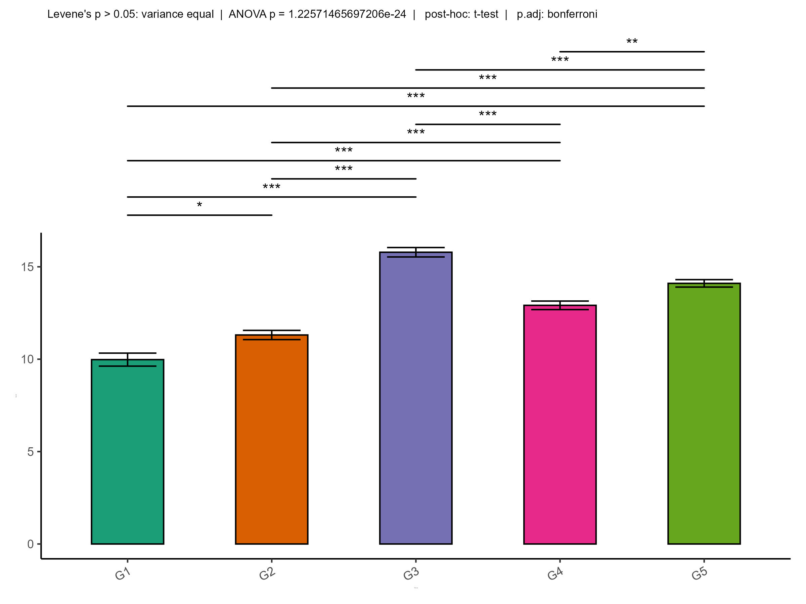
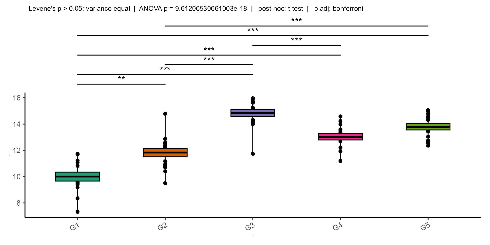
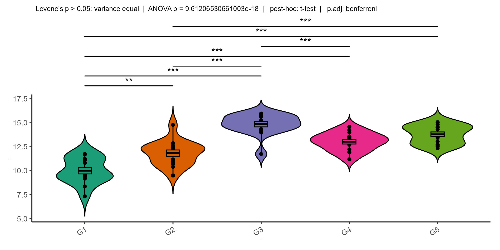
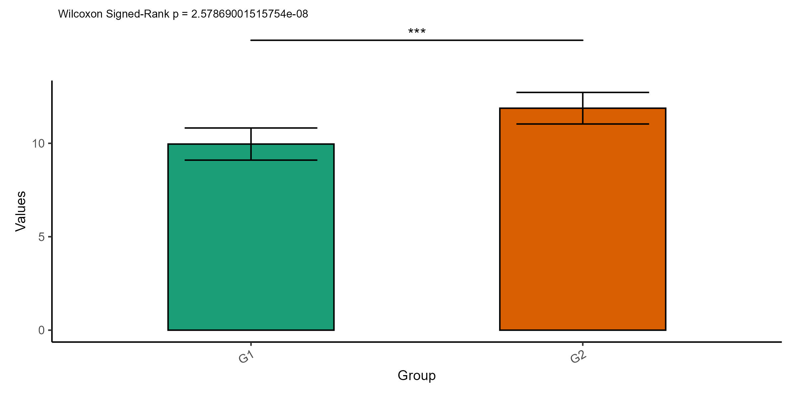
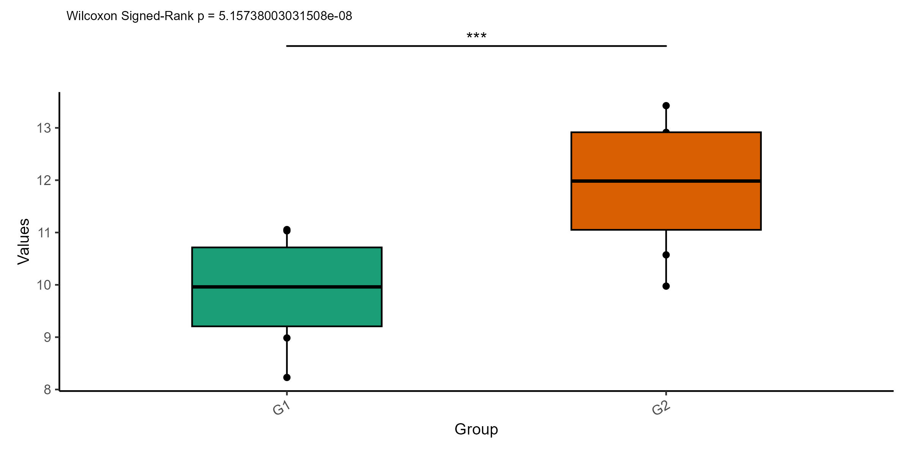
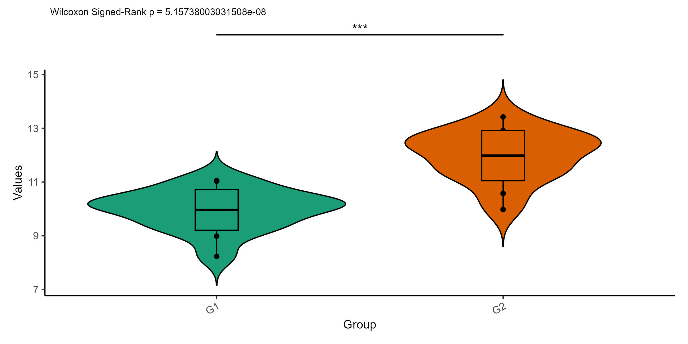

### JStatML-R – R Tool for group statistics conduction


<br />


<p align="right">


</p>


### Author: Jakub Kubiś


<br />

## Description

JStatML-R is an R-based tool designed to facilitate fast, automated, and user-friendly group statistical analysis. It enables researchers to:

- Easily compare groups using statistical tests (e.g., t-test, ANOVA, non-parametric tests), 

- Visualize results with bar plots, boxplots, and scatter plots,

- Automatically generate reports including p-values, test statistics, and sample sizes,

- Analyze input data in CSV or Excel format,

- Handle multiple variables and groups simultaneously.

JStatML-R is ideal for biologists, clinicians, and anyone analyzing experimental or clinical datasets. Thanks to its open-source structure, the tool can be easily customized to suit specific research needs.


<br />


#### Loading

```
source("https://raw.githubusercontent.com/jkubis96/JStatML-R/main/scripts/statML-R.R")

```

<br />

#### Documentation

* [JStatML-R ](https://jkubis96.github.io/CSSG/)

<br />


#### Example usage in R

```
source("https://raw.githubusercontent.com/jkubis96/JStatML-R/main/scripts/statML-R.R")


df <- data.frame(
  value = c(rnorm(15, mean = 10), rnorm(15, mean = 12), rnorm(15, mean = 15), rnorm(15, mean = 13), rnorm(15, mean = 14)),
  group = rep(c("G1", "G2", "G3", "G4", "G5"), each = 15)
)


stats <- get_stats(df, "value", "group")


fc <- avg_FC(stats)


results <- test_multi_groups(df, value_column = "value", grouping_column = "group", parametric = TRUE)

results@test
results@leven_var_test
results@posthoc_test
results@test_data
results@posthoc_data


result <- multi_groups_analysis(value_column = 'value', 
                                grouping_column = 'group', 
                                data = df, 
                                bar_queue = c("G1", "G2", "G3", "G4", "G5"), 
                                x_label = 'Group', 
                                x_angle = 30, 
                                y_label = 'Value', 
                                size = 1, 
                                parametric = TRUE, 
                                paired = FALSE, 
                                include_ns = FALSE, 
                                bars = 'sem', 
                                bars_size = 1,
                                bar_size = 0.5,
                                stat_plot_ratio = 0.4,
                                stat_hight = 0.6,
                                adjustment.method = 'bonferroni', 
                                y_break = NA, 
                                brew_colors = 'Dark2'
  
          )

result@bar_plot 
result@violin_plot 
result@box_plot 
result@statistic_tests 
result@statistic_data 
result@statistic_txt_resum 
result@avg_FC_results  
```
<br />


***Bar plot - multi groups***

<br />


<p align="center">

</p>


<br />


***Box plot - multi groups***

<br />


<p align="center">

</p>


<br />


***Violin plot - multi groups***

<br />


<p align="center">

</p>


<br />


```
source("https://raw.githubusercontent.com/jkubis96/JStatML-R/main/scripts/statML-R.R")


df <- data.frame(
  value = c(rnorm(15, mean = 10), rnorm(15, mean = 12)),
  group = rep(c("G1", "G2"), each = 15)
)


results <- test_two_groups(df, value_column = "value", grouping_column = "group", parametric = TRUE)

results@test
results@p.val
results@statistic
results@paired


result <- two_groups_analysis(value_column = "value", 
                              grouping_column = "group", 
                              data = df,
                              bar_queue = c('G1', 'G2'), 
                              x_label = 'Group', 
                              x_angle = 30, 
                              y_label = 'Values', 
                              size = 10, 
                              bar_size = 0.5, 
                              parametric = FALSE, 
                              paired = TRUE, 
                              bars = 'sd', 
                              bars_size = 1, 
                              stat_plot_ratio = 0.2, 
                              y_break = NaN, 
                              brew_colors = 'Dark2')

result@bar_plot 
result@violin_plot 
result@box_plot 
result@statistic_tests 
result@statistic_data 
result@statistic_txt_resum 
result@avg_FC_results  
```
<br />


***Bar plot - two groups***

<br />


<p align="center">

</p>


<br />


***Box plot - two groups***

<br />


<p align="center">

</p>


<br />


***Violin plot - two groups***

<br />


<p align="center">

</p>


<br />


```
source("https://raw.githubusercontent.com/jkubis96/JStatML-R/main/scripts/statML-R.R")


df <- data.frame(
  value = c(rnorm(15, mean = 10), rnorm(15, mean = 12), rnorm(15, mean = 15), rnorm(15, mean = 13), rnorm(15, mean = 14)),
  time = rep(c("Day1", "Day2", "Day3"), times = 25),  
  group = rep(c("G1", "G2", "G3", "G4", "G5"), each = 15)
)


results <- multi_var_groups_analysis(data = df,
                                    stat_col = "value",
                                    interval_col = "time",
                                    group_col = "group",
                                    parametric = TRUE,
                                    paired = FALSE,
                                    adj = "bh",
                                    error = "sem",
                                    tx_pos = 0.04)

results@plot
results@statistic_group
results@test_name
results@statistic_post_hoc
results@stats
results@avg_FC_results
```
<br />


***Line plot - multi groups***

<br />


<p align="center">

</p>


<br />


```
source("https://raw.githubusercontent.com/jkubis96/JStatML-R/main/scripts/statML-R.R")

df <- data.frame(
  value = c(
    rnorm(15, mean = 10),  
    rnorm(15, mean = 12),  
    rnorm(15, mean = 14),  
    rnorm(15, mean = 11),  
    rnorm(15, mean = 13),  
    rnorm(15, mean = 15)   
  ),
  time = rep(c("Day1", "Day2", "Day3"), times = 2, each = 15),
  group = rep(c("G1", "G2"), each = 45)
)


results <- multi_var_groups_analysis(data = df,
                                     stat_col = "value",
                                     interval_col = "time",
                                     group_col = "group",
                                     parametric = FALSE,
                                     paired = FALSE,
                                     adj = "bh",
                                     error = "sd",
                                     tx_pos = 0.04)

results@plot
results@statistic_group
results@test_name
results@statistic_post_hoc
results@stats
results@avg_FC_results
```
<br />


***Line plot - two groups***

<br />


<p align="center">

</p>


<br />

<br />

<br />


#### Have fun JBS©